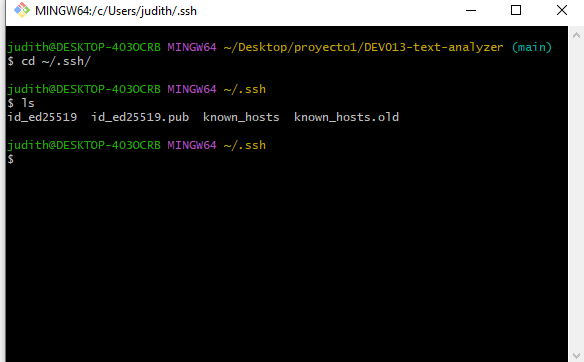
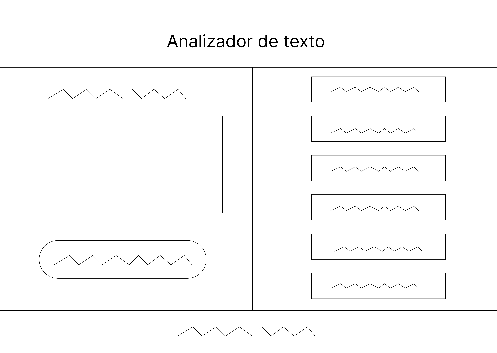
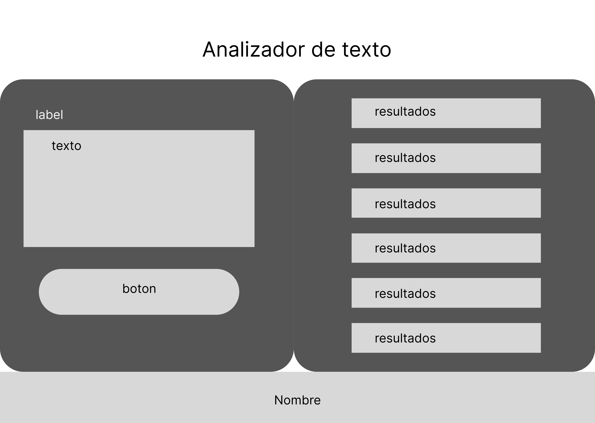
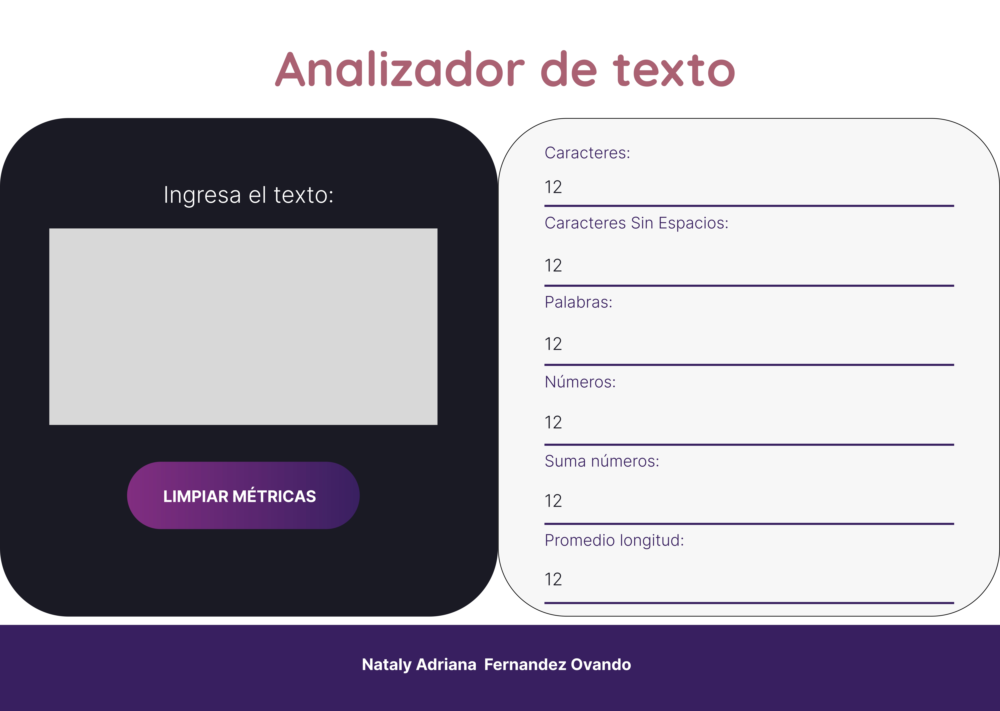
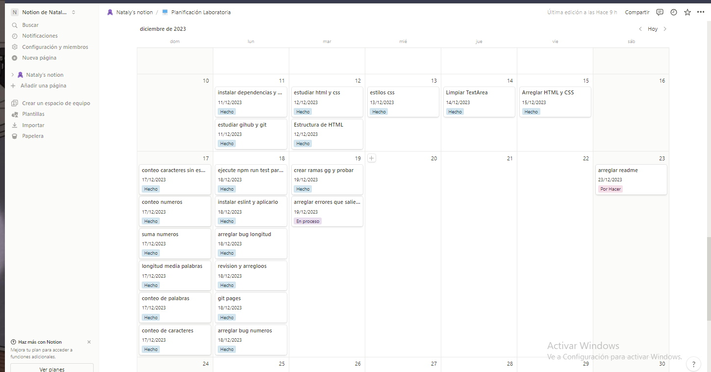

# Analizador de texto

## Quieres probar el proyecto?
dale click a este [link](https://N4T4LY.github.io/DEV013-text-analyzer)

Ingresa los datos que quieras y pruebalo :D!

## Pasos, desarrollo y aprendizajes dentro del desarrollo del proyecto

Para el desarrollo del proyecto realicé los siguientes pasos:

* [1. Preparación del entorno de trabajo ](#1-preparación-del-entorno-de-trabajo)
* [2. Prototipo](#2-prototipo)
* [3. Estructura del proyecto en HTML](#3-estructura-del-proyecto-en-html)
* [4. Diseño del proyecto con CSS](#4-diseño-del-proyecto-con-css)
* [5. Funcionalidades con Javascript](#5-funcionalidades-con-javascript)
* [6. Tests](#6-tests)
* [7. Aprendizajes y herramientas complementarias](#7-aprendizajes-y-herramientas-complementarias)

***

## 1. Preparación del entorno de trabajo

* Lo primero que hice fue realizar un fork del github de Laboratoria en mi cuenta. Una vez hecho esto, investigue sobre las llaves SSH y como clonar el repositorio con esta llave.
En esta parte aprendi que las credenciales ssh son como un tipo de cifrado de autenticación para establecer una conexión con un servidor sin tener que utilizar una contraseña. Este método de autentificación necesita utilizar una Llave Privada y otra Llave Pública.

* Cuando terminé de crear mi llave SSH, cloné el repositorio con ella.
* Una vez el proyecto en mi computadora, preparé el entorno actualizando el nodejs de mi computadora, e instalando sus dependencias dentro del proyecto con npm install y de igual forma instale playwright

*Durante este periodo tambien me puse a revisar y a estudiar sobre Git.

## 2. Prototipo

Ya con todo listo me puse a hacer el prototipo del diseño de mi aplicación web, para ello hice los prototipos en Figma de acuerdo al nivel de fidelidad:
### Fidelidad Baja

### Fidelidad Media

### Fidelidad Alta

Los colores se tomaron en cuenta con [coolors.co](https://coolors.co/822e81-aa6373-f0f2a6-392061-1a1b25). y el diseño esta pensado tomando en cuenta los criterios de UI, tanto con el contraste de colores como en la legibilidad de la tipografia, etc.

## 3. Estructura del proyecto en HTML

* Ya en la estructura de proyecto en html. se siguio las especificaciones del readme original del proyecto.
se uso un encabezado h1 dentro del header para el titulo.
* Dentro de main, se hizo el contenido de la aplicación, se usó 2 divs, ingresados dentro de un form.
el 1er div es utilizado para la sección del textarea y el botón donde se ingresa los datos. Y el 2do div es donde se encuentra la lista de los resultados.
* Ya en el footer ingresé mi nombre y el año donde se hizo el proyecto. 
* Dentro del index.html se ingreso los links de la hoja de estilos, de las fuentes escogidas de google fonts y el script para conectar el documento js.

Dentro de html, algo nuevo que aprendí fue sobre el atributo "data-testid" que no es un atributo estándar de HTML, sino que es un atributo personalizado que agregamos para facilitar la identificación y selección de elementos en las pruebas automatizadas.

## 4. Diseño del proyecto con CSS

Ya con la estructura html, se aplicó los estilos con css. 
* Se aplicó estilos a diferentes selectores, además del modelo de caja, aplique margin, padding, border, etc.
* Se aplicó fuentes diferentes con ayuda de Google Fonts
* Se utilizó las variables para aplicar la paleta de colores que se generó con la paleta creada anteriormente.
* En la página entera se aplicó un box-sizing para que al aplicar caracteristicas como el margen, etc. no haya problemas con el ajuste de ancho y altura de los elementos
* Se aplicó un display: flex para poder ubicar los divs que son elementos block, uno al lado de otro

Las cosas nuevas que aprendí fueron la aplicación de las variables de los colores. De igual forma, tambien aprendí sobre como aplicar estilo a un selector de atributo con el textarea[name="user-input"] como ejemplo.

## 5. Funcionalidades con Javascript
* Para las funcionalidades en javascript lei como va funcionando el import y el export y como van relacionados en el index.html. 
Con export ayudamos a enviar funciones, objetos, etc. y con la sentencia import podemos utilizar estas funciones en diferentes programas. En este caso, el index.js
* Una vez entendido eso, en index.js empecé las funcionalidades, comenzando con el botón de limpiar el textarea., para ello utilice un metodo de javascript que sirve para recargar la pagina que es el location.reload(). Tanto este evento como el de mostrar los resultados de mi textarea en la lista, utilizo el addEventListener.
* En el mismo documento capturé el contenido del textarea en una variable, utilizando un queryselector y posteriormente capture el espacio de los li igual con queryselector para mostrar los resultados despues.
* Creé una función con addEventListener para que una vez tenga el valor almacenado en una variable del textarea lo mande a cada una de las funciones como parametro para que en el analyzer.js y se despliegue en cada uno de los espacios de la lista.

Aqui, una muestra
//funcion, con addevenlistener escucho el valor del textarea y ejecuto las funciones del analyzer
textarea.addEventListener("input",()=>{
    
  //capturo el valor de textarea y lo almaceno en text
  let text =textarea.value;

  //creo una variable donde almaceno el resultado de las funciones mandando el valor del textarea y la despliego en su li respectivo con el textcontent
  let contarpalabras=analyzer.getWordCount(text);
  mostrarnumpalabras.textContent=`Recuento palabras: ${contarpalabras}`;})

* En analyzer.js fui haciendo las funciones para cada caso. Utilice métodos de cadenas de texto de javascript para resolver cada uno. trim(), match(), replace(), split(), y para convertir cadenas en números y el manejo de estos usé parseInt(), parseFloat() y toFixed()
* Para manejo de caracteres usé las expresiones regulares, como \b, \d, /g, \s.\w

En este caso, todo lo que use y apliqué fue casi todo nuevo para mi, a excepcion de los addEventListener y la aplicación de document.query selector que fueron cosas que apliqué en el proyecto anterior.

## 6. Tests
* Para los tests instale eslint en el proyecto, instale su extensión en vs code, lo agregue al package.json del proyecto y al investigar sobre ello, lo configure para que simplemente al guardar, eslint corrija los errores automaticamente.
* Una vez hecho todo eso. ejecuté los tests y una vez se ejecutaron fui corrigiendo los errores que aparecieran.

Esta parte tambien fue nueva para mi, por lo que lo que la parte de los tests los aprendi recien en este proyecto.

## 7. Aprendizajes y herramientas complementarias

* Como complemento, tambien aprendí sobre la Github pages, averigue sobre que cosas modificar en el package.json y el comando para instalarlo en el proyecto. 
* De igual forma durante el desarrollo del proyecto aprendí a usar la herramienta de Notion para poder organizar el desarrollo de mi proyecto. 

Fue un gran viaje y estoy muy contenta de haber aprendido demasiado! :D